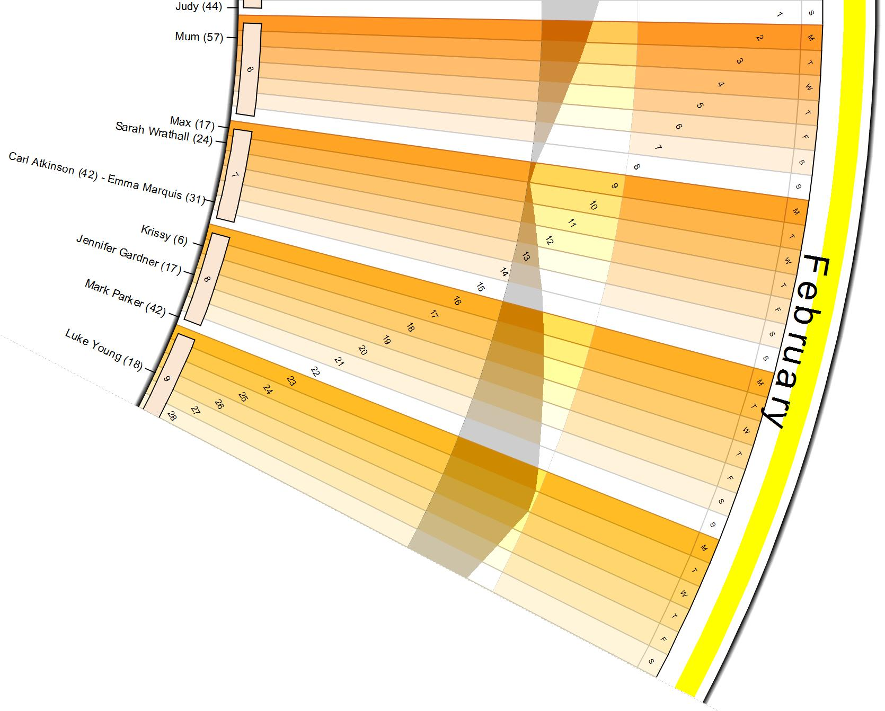



## Round Calander

### Description

Create (print) a large wall round calendar. Some code borrowed, their name should be in the BAS files. Some information taken from Microsoft Outlook and printed on the calendar too.
 
### More Info
 

             |
---                |---
**Submitted On**   |2009-06-02 10:22:22
**By**             |[Gary Eyles](https://github.com/Planet-Source-Code/PSCIndex/blob/master/ByAuthor/gary-eyles.md)
**Level**          |Advanced
**User Rating**    |4.8 (19 globes from 4 users)
**Compatibility**  |VB 6\.0
**Category**       |[Graphics](https://github.com/Planet-Source-Code/PSCIndex/blob/master/ByCategory/graphics__1-46.md)
**World**          |[Visual Basic](https://github.com/Planet-Source-Code/PSCIndex/blob/master/ByWorld/visual-basic.md)
**Archive File**   |[Round\_Cala215421642009\.zip](https://github.com/Planet-Source-Code/gary-eyles-round-calander__1-72154/archive/master.zip)

